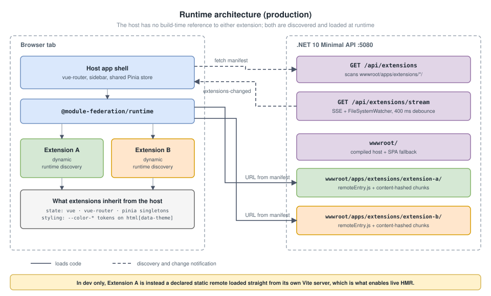
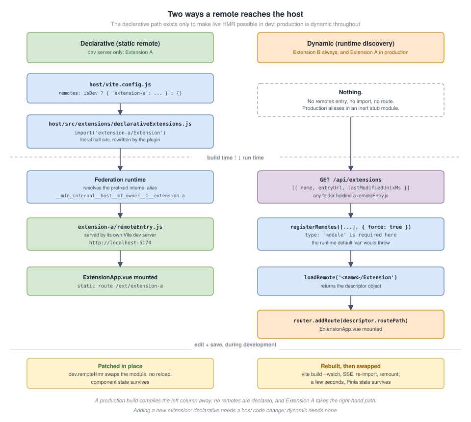
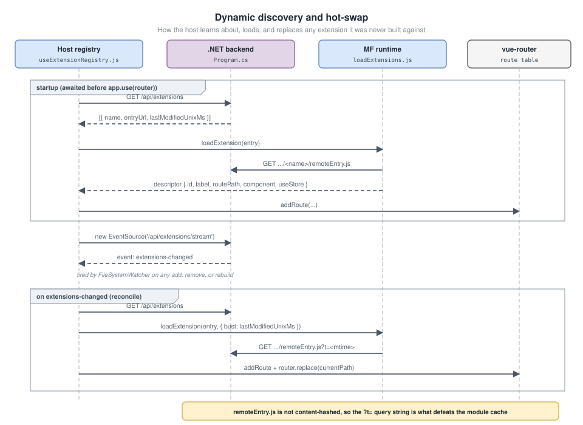
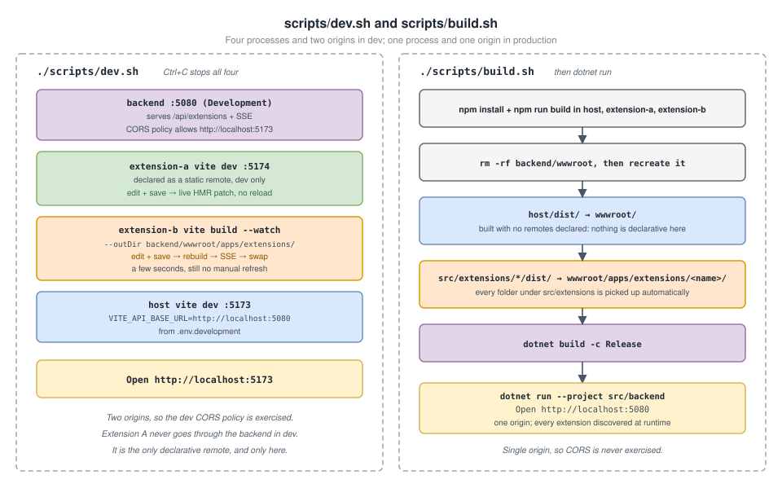

# Module Federation with Vue, Vite, and .NET

A working demonstration of **Module Federation**: a Vue 3 host application that
loads two independently built, independently deployable "extensions" at
runtime, served by a .NET 10 Minimal API.

**In production the host knows nothing about either extension.** Both are
discovered from a backend API and loaded at runtime, so a new extension is a
deployment step, not a code change.

The comparison the project exists to show is a **development-time** one. Vite's
federation plugin can patch a remote's code live, with no reload, but only if
the host declares that remote at dev-server startup. Extension A is wired that
way in the dev server, and only there, to demonstrate the difference:

|                              | Extension A                           | Extension B                           |
| ---------------------------- | ------------------------------------- | ------------------------------------- |
| **In production**            | Discovered at runtime                 | Discovered at runtime                 |
| **In the dev server**        | Declarative (static remote)           | Dynamic (runtime discovery)           |
| **Edit + save during dev**   | Patched in place, no reload           | Rebuild, then automatic swap          |
| **Latency**                  | Instant                               | A few seconds                         |
| **Adding another one needs** | Nothing, drop a built folder in place | Nothing, drop a built folder in place |

Two things cross the federation boundary, by two different routes. **State**
travels through shared singletons: the extensions use the host's Vue,
`vue-router`, and Pinia instances, so the sidebar shows a live summary of each
extension's store even while that extension is unmounted. **Styling** travels
through the CSS cascade: the host's light and dark themes restyle every
extension without an extension importing anything.

---

## Quick start

**Requirements:** Node `^20.19.0 || >=22.12.0` (Vite 8's own engine range) and
the .NET 10 SDK.

### Run the production build

```bash
./scripts/build.sh
dotnet run --project src/backend --urls http://localhost:5080
```

Open <http://localhost:5080>. Everything is served from one origin.

### Run the dev environment

```bash
./scripts/dev.sh
```

Open <http://localhost:5173>. Edit
`src/extensions/extension-a/src/ExtensionApp.vue` and watch it patch live. Edit
`src/extensions/extension-b/src/ExtensionApp.vue` and watch it rebuild and swap
a few seconds later. Ctrl+C stops everything.

### Run one extension in isolation

```bash
cd src/extensions/extension-a && npm run dev   # http://localhost:5174
cd src/extensions/extension-b && npm run dev   # http://localhost:5175
```

Each renders its widget through a standalone preview harness, with neither the
host nor the backend running. This is ordinary Vite HMR, unrelated to the
federation mechanisms above.

---

## Architecture



```
src/
  backend/            .NET 10 Minimal API
    Program.cs          static files + discovery API + SSE watcher
    wwwroot/            assembled by scripts/build.sh
      apps/extensions/    one folder per built extension

  host/               Vue 3 + Vite, the federation consumer
    vite.config.js      declares extension-a as a remote in dev only, and
                          aliases @declarative-extensions per build mode
    src/
      router.js           "/" plus any declarative routes, which is none in prod
      extensions/
        declarativeExtensions.js       dev: extension A's route + metadata
        declarativeExtensions.prod.js  prod: the inert stub that replaces it
        loadExtensions.js              federation runtime calls
        useExtensionRegistry.js        fetch, load, swap, SSE, route management
      views/              HomeView, ExtensionUnavailableView

  extensions/
    extension-a/        also runs its own dev server, for HMR
    extension-b/        built into wwwroot, discovered from there
      src/
        ExtensionApp.vue  the widget UI
        store.js          Pinia store with a generic `summary` getter
        extension.js      the exposed `./Extension` descriptor

scripts/
  build.sh            build all three, assemble wwwroot, build the backend
  dev.sh              four watched processes, cleaned up together
```

Both extensions are independently buildable Vite projects. Neither imports from
the other, and neither imports from host source. In production the host is
symmetric: it has no build-time knowledge of either. The asymmetry exists only
in the dev server, and only to make live HMR possible for one of them.

### The descriptor contract

Every extension exposes one module, `./Extension`, returning the same shape:

```
{ id, label, routePath, component, useStore }
```

That is the entire interface. It is what lets the host build a sidebar entry, a
route, and a status line for an extension it knows nothing else about.

---

## Two approaches to HMR



**Declarative (Extension A, dev server only).** The host names the remote in
`vite.config.js` and loads it through a literal `import('extension-a/Extension')`
call site. The plugin's `dev.remoteHmr` option rewrites that call site and
patches the module in place on change. Verified end to end: with the click
counter at 3, editing the mounted component's heading updated the DOM with the
counter still at 3, zero navigations, and no console errors.

**Dynamic (everything, always).** The extension is discovered from the backend
at runtime. On edit, `vite build --watch` rewrites the bundle, the backend's
`FileSystemWatcher` pushes an SSE event, and the host re-imports the remote and
swaps the mounted component. Slower, but no manual refresh, and Pinia state
survives the remount.

The two cannot be combined: automatic HMR patching requires the host to know
its remotes at dev-server startup, which is exactly what a runtime-driven host
gives up. So the fast loop is taken where it is free, and dropped where it
would cost real flexibility. A production build declares no remotes, and a
resolver alias swaps the declarative module for an inert stub, keeping the
unresolvable import out of the bundle entirely.

**→ [Full comparison, how the split is enforced, and how to choose](./docs/hmr-approaches.md)**

---

## Dynamic discovery



`GET /api/extensions` scans `wwwroot/apps/extensions/*/` for any folder holding
a `remoteEntry.js` and returns `[{ name, entryUrl, lastModifiedUnixMs }]`. The
host registers each entry with the federation runtime, imports its descriptor,
and calls `router.addRoute()`.

`GET /api/extensions/stream` is a Server-Sent Events endpoint backed by a
debounced `FileSystemWatcher`. On any add, remove, or rebuild, the host
re-reconciles: new extensions load, removed ones lose their route, and changed
ones are re-imported with a cache-busting `?t=<mtime>` and swapped in place.

Adding an extension requires no backend code change and no host code change.

**→ [The full mechanism, including the router-refresh gotcha](./docs/dynamic-discovery.md)**

---

## Theming: CSS across the boundary

The sidebar offers Auto, Light, and Dark. Auto follows `prefers-color-scheme`
and tracks OS changes live; an explicit choice is persisted and wins.

The host defines semantic tokens (`--color-surface`, `--color-text`, and so on)
on `:root` and flips a single `data-theme` attribute. Extensions consume those
tokens in their own scoped styles, with fallbacks so their standalone previews
still work:

```css
.extension-b {
  border: 1px solid var(--color-border, #d8dee4);
  background: var(--color-surface, #ffffff);
  color: var(--color-text, #1f2328);
}
```

No extension imports the theme store, and none could: extensions never import
host source. They do not need to. Remotes render into the host's DOM, so the
cascade reaches them for free. Pinia carries the user's _choice_; CSS carries
the _presentation_. An iframe-based microfrontend gets neither.

**→ [Token contract, no-flash loading, and the practices behind it](./docs/theming.md)**

---

## What Module Federation buys, and what it costs

Module Federation lets one running application import a JavaScript module that
some **other build** compiled and deployed, then run it inside the same page,
DOM, and JavaScript realm. Shared dependencies get negotiated at runtime, so
the browser loads a single copy of Vue however many teams ship into the page.

**Benefits:** every team deploys on its own schedule; framework code is not
duplicated per team; remotes render into the host's DOM rather than an iframe;
and the set of loadable modules becomes a runtime decision, which is what makes
a plugin architecture possible.

**Costs:** version skew escapes the build and surfaces in a user's browser;
nothing type-checks across the boundary; stack traces span separately compiled
bundles; each remote adds a deployable artifact to operate; and a remote
executes with the host's full privileges.

**Use it when independent deployment is the actual requirement.** If you only
want code reuse, use a package: a monorepo with a shared component library
gives the same reuse with compile-time safety and none of the runtime
negotiation.

**→ [Concepts, benefits, costs, and when to use it](./docs/module-federation.md)**

---

## Scripts



### `./scripts/build.sh`

1. `npm install` and `npm run build` in `src/host` and every folder under
   `src/extensions/`.
2. Reset `src/backend/wwwroot`.
3. Copy `host/dist/` to `wwwroot/`.
4. Copy each `extensions/*/dist/` to `wwwroot/apps/extensions/<name>/`.
5. `dotnet build -c Release`.

Step 4 iterates over folders, so a new extension is picked up with no edit to
the script.

### `./scripts/dev.sh`

Starts four processes and stops all of them on Ctrl+C:

| Process                              | Port | Behaviour                                         |
| ------------------------------------ | ---- | ------------------------------------------------- |
| backend (`Development`)              | 5080 | serves the API and SSE; CORS allows `:5173`       |
| `extension-a` (`vite dev`)           | 5174 | declared as a static remote here only; live HMR   |
| `extension-b` (`vite build --watch`) | n/a  | writes into the backend's `wwwroot`               |
| host (`vite dev`)                    | 5173 | reads `VITE_API_BASE_URL` from `.env.development` |

### Root package scripts

Repo-wide lint and format tooling. Each sub-project keeps its own
`package.json` for building and running itself.

```bash
npm run lint          # eslint .
npm run lint:fix
npm run format        # prettier --write .
npm run format:check
```

### CORS

Production is single-origin, so CORS is never exercised. Dev is not: the host
is on `:5173`, the backend on `:5080`. The backend's `DevClients` policy allows
that origin, and applies only when `ASPNETCORE_ENVIRONMENT=Development`.
Extension A's dev loading bypasses the backend entirely, which is why its own
`vite.config.js` sets `cors: true` and a fixed `origin`.

---

## Documentation

| Document                                                 | Contents                                                       |
| -------------------------------------------------------- | -------------------------------------------------------------- |
| [Module Federation](./docs/module-federation.md)         | Concepts, shared singletons, benefits, costs, when to use it   |
| [Two approaches to HMR](./docs/hmr-approaches.md)        | Declarative vs dynamic in depth, gotchas, how to choose        |
| [Dynamic discovery](./docs/dynamic-discovery.md)         | Manifest, SSE, reconcile, hot-swap, design trade-offs          |
| [Theming](./docs/theming.md)                             | Light and dark themes, CSS tokens across the boundary          |
| [Build a federated app](./docs/build-a-federated-app.md) | Step-by-step construction, adding a third extension, checklist |

Diagrams in `docs/assets/` are SVGs with an embedded draw.io model. They render
anywhere and can be opened directly in [app.diagrams.net](https://app.diagrams.net)
for editing.

## Stack

Vue 3.5 · Vite 8 · vue-router 4 · Pinia 4 · `@module-federation/vite` 1.20 ·
`@module-federation/runtime` 2.8 · .NET 10 Minimal API
